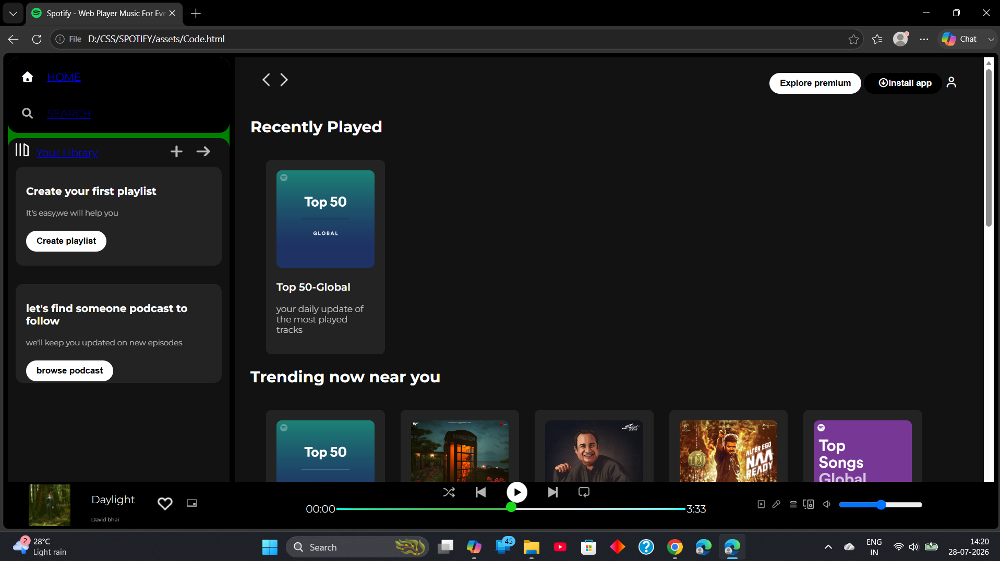

# Spotify Interface (Practice Project)

A static Spotify-inspired interface built with **HTML** and **CSS**.

This project was created by following a web development course and is intended for learning and practice purposes only. It does not include any real functionality—only a visual clone of the Spotify interface.

## 🚀 Features

- Spotify-inspired user interface
- Built using HTML and CSS
- Practice project for learning front-end development

## 📁 File Structure

- The `assets` folder contains:
  - `Code.html` (main HTML file)
  - `Code.css` (stylesheet)
  - Images and icons used in the project

## 🛠️ Tech Stack

- HTML5
- CSS3

## 📷 Screenshot

## 🙏 Credits

This project was built by following the **Apna College Web Development Course** for learning purposes. I coded the project while following the course to practice HTML and CSS. Thanks to the course instructor for the guidance.

## 📌 Note

This is a practice project and is not affiliated with Spotify. All trademarks, logos, and design inspiration belong to Spotify.
